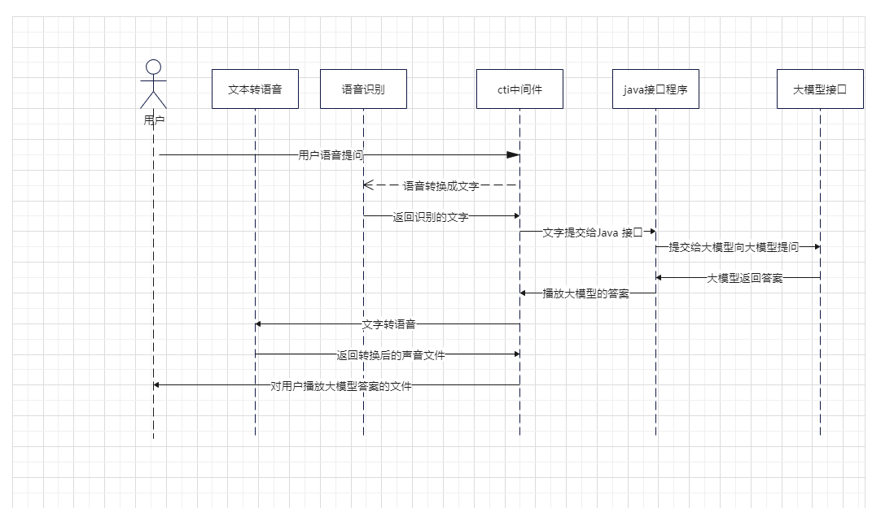

电话机器人对接阿里灵积大模型的例子
===

## 介绍

自chatgpt3.5发布以来，各种大模型飞速发展，各行各业都有接入大模型的需求，呼叫中心行业非常适合通过接入大模型用AI来回答用户的各种咨询，降低人力资源，使用顶顶通呼叫中心中间件，可以非常简单容易的让电话机器人系统，呼叫中心系统快速接入各种大模型，本例子演示了如果使用顶顶通呼叫中心中间件接入阿里灵积大模型的例子。

## 流程图

1. 用户语音提问->cti中间件语音转文字->返回识别的文字->提交给java接口->向大模型提问->大模型返回答案->文字转语音->返回转换后的声音文件->对用户播放大模型答案的文件

## 测试方法

可以联系顶顶通测试效果，测试效果视频请看

## 用法说明
准备工作
1. 配置了java 环境，安装了Maven 环境。
2. 安装了FreeSWITCH。
3. 安装了顶顶通语音接口。
4. 下载ccAdmin和sipphone。
5. 申请了阿里灵积大模型api_key。

## 相关资料

1. 顶顶通呼叫中心中间件接口文档  http://www.ddrj.com/callcenter/httpflow.html
2. java程序和顶顶通呼叫中心中间件 对接方法 https://blog.csdn.net/qq_52528295/article/details/134186331
3. 阿里灵积大模型接口文档  https://help.aliyun.com/zh/dashscope/developer-reference/activate-dashscope-and-create-an-api-key?spm=a2c4g.11186623.0.0.588216e9CpLp2k
